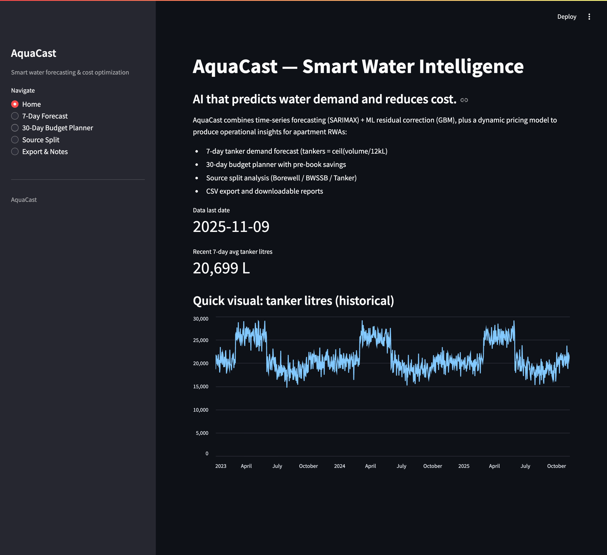
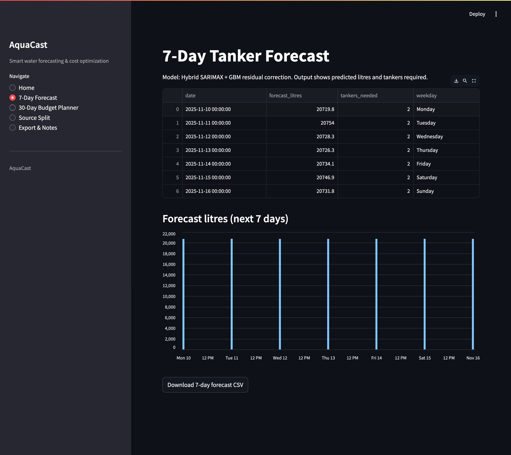
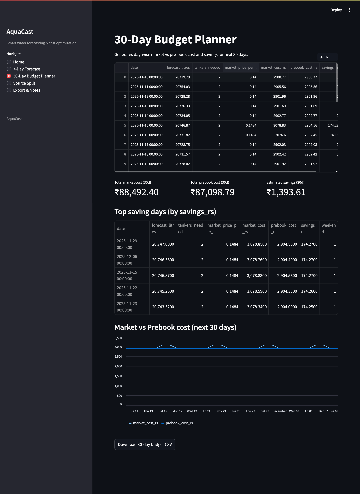
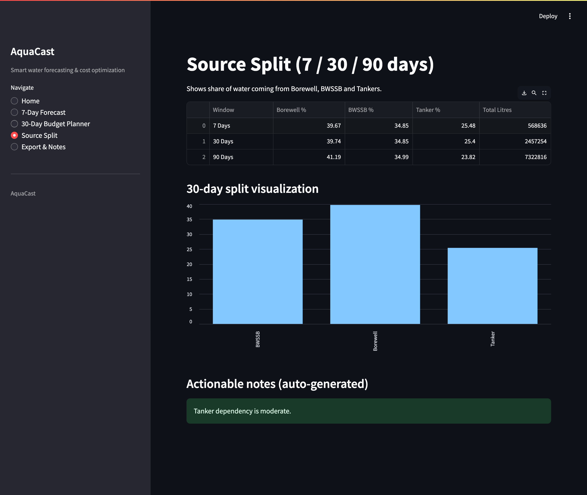
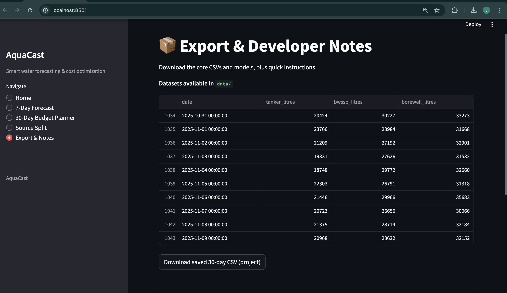

#  AquaCast

**AI-powered Forecasting & Cost Optimization for Apartment Water Management**

*Hybrid SARIMAX + Gradient Boosting • 7/30-day Tanker Forecasts • Dynamic Pricing • Source Split Analytics*  

**Interactive Streamlit Dashboard**

---

##  Overview

**AquaCast** is an AI-driven water forecasting system designed for RWAs, apartment communities, and water administrators.

It combines:
-  **SARIMAX** time-series forecasting  
-  **GBM** residual correction (Hybrid ML)  
-  **Dynamic tanker price modeling**  
-  **30-day cost optimization planner**  
-  **Real-time 7-day tanker requirement forecast**  
-  **Source split breakdown** (Borewell / BWSSB / Tanker)

Built as a **production-ready Streamlit app**, AquaCast is suitable for **real deployments**, **interviews**, and **portfolio showcases**.

---

##  Key Features

### 7-Day Demand Forecast
- Hybrid **SARIMAX + GBM** model  
- Predicts daily tanker litres  
- Automatically calculates `tankers = ceil(litres / 12,000)`  
- Weekday awareness (weekend spikes)

###  30-Day Budget Planner
- Predicts **market vs pre-book** cost  
- Identifies **top savings days**  
- Calculates **total monthly water cost**  
- Helps RWAs **plan expenses efficiently**

###  Source Split Analysis
Shows exact contribution by:
- Borewell  
- BWSSB  
- Tanker water  

Across **7-day**, **30-day**, and **90-day** windows.

---

##  Modular Architecture
- `/modules/` → Reusable forecasting, pricing, and analytics modules  
- `/models/` → Trained SARIMAX + GBM models + metadata  
- `/data/` → Datasets & exported results  

---

##  Interactive Streamlit Dashboard
Includes:
- Home summary  
- 7-day forecast  
- 30-day budget planner  
- Source split analytics  
- Export section  
- Downloadable CSV reports  

---

  
View All Screenshots

   

  
   
  
   
  
   
  
   
  

##  Author
Developed by **Jithesh M**  
💻 [GitHub](https://github.com/JivithJJ) •
